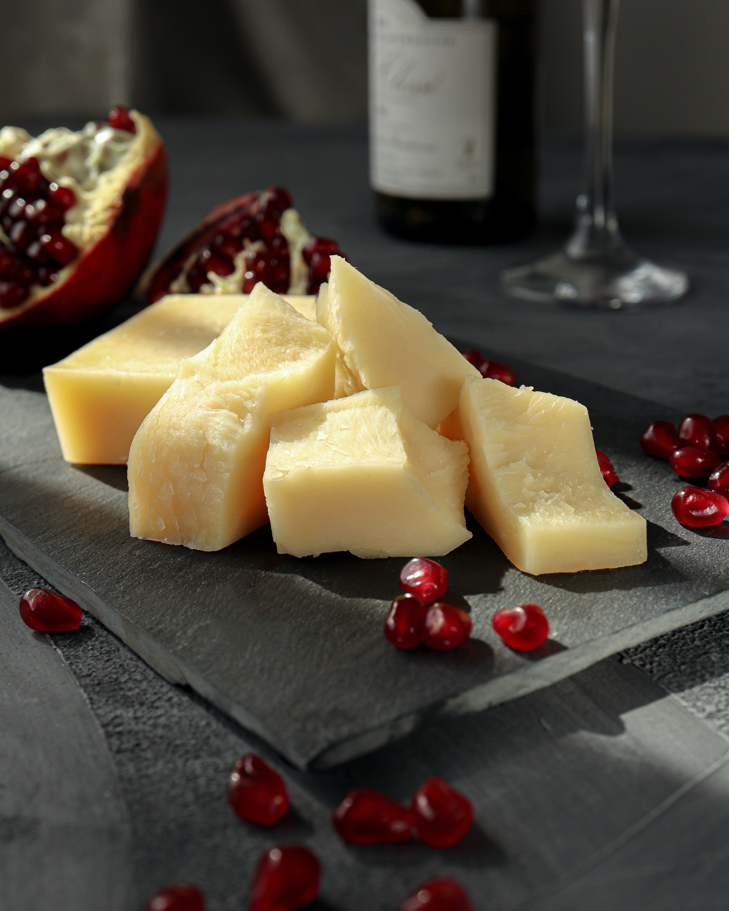
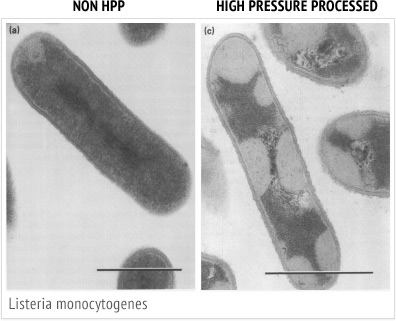

```{r setup, include=FALSE}
knitr::opts_chunk$set(echo = FALSE)
```


## The Set-Up {data-background=background.jpg data-background-size=cover}
<div class= "black">

**Our team has been approached by a business person who happens to love dairy products! They are interested in starting a dairy to live out their childhood dreams, but are not sure where to start. We combed the USDA and FDA data to make recommendations to ensure they get the best dairy possible.**
</div>

## HOLY COW!


There is a lot to consider! Maybe exploratory analysis can help!

```{r cows, echo = FALSE, warning=FALSE, message=FALSE, fig.align='center'}
library(magick)
library(magrittr)
library(purrr)

cowsgif<-list.files("Cow Pics PNG", pattern = '*.png', full.names = TRUE) %>% 
        image_read() %>% 
        image_join() %>% 
        image_scale("x500")%>%
        image_animate(fps=2) 

cowsgif
```

## Questions to Answer 

- Where is the best place in the United States to run a dairy operation?
- What products are the most profitable?
- What are hazards to look out for during production to avoid recalls?


## Where should we operate?

### Introducing the milk produced by state from 1970 to 2017.


This data set includes 2400 rows with the variables:

- Region
- State
- Year
- Milk Produced

## Digging into the data


```{r pullindairy, include = FALSE}
# Silent Chunk! Say hello to the data!
urlfile <- "https://raw.githubusercontent.com/rfordatascience/tidytuesday/master/data/2019/2019-01-29/state_milk_production.csv"
dairycsv <- read.csv(urlfile)
dairybystate <- as.data.frame(dairycsv)
```

First we need to explore a little.
```{r exploremilk, echo = TRUE}
which.min(dairybystate$milk_produced)
which.max(dairybystate$milk_produced)
```

```{r line1, echo = FALSE}
dairybystate[2199,]
```

```{r line2, echo = FALSE}
dairybystate[2248,]
```

## My country tis of thee, sweet land of milk and cheese
```{r silentmap, include = FALSE}
# Another silent chunk! Here comes big fun!

library(usmap)
library(ggplot2)
library(tidyverse)

dairy70 <- dairybystate %>% filter(year == 1970)
dairy80 <- dairybystate %>% filter(year == 1980)
dairy90 <- dairybystate %>% filter(year == 1990)
dairy00 <- dairybystate %>% filter(year == 2000)
dairy10 <- dairybystate %>% filter(year == 2010)
dairy17 <- dairybystate %>% filter(year == 2017)

usa70 <- plot_usmap(regions = "states", data = dairy70, values = "milk_produced", color = "black") + 
  scale_fill_continuous(low = "purple", high = "orange", name = "Production, lb", label = scales::comma, breaks = c(10000000000, 20000000000, 30000000000, 40000000000), limits = c(2500000000, 45000000000)) +
  labs(title = "Dairy Production in the United States",
       subtitle = "Changes in dairy produciton by state in 1970") + 
  theme(panel.background = element_rect(color = "black", fill = "white"), legend.position = "right")

ggsave(filename = "usa70.png", plot=usa70,width=4,height=4,units="in",scale=1)
usa70pic <- image_read("usa70.png")

usa80 <- plot_usmap(regions = "states", data = dairy80, values = "milk_produced", color = "black") + 
  scale_fill_continuous(low = "purple", high = "orange", name = "Production, lb", label = scales::comma, breaks = c(10000000000, 20000000000, 30000000000, 40000000000), limits = c(2500000000, 45000000000)) +
  labs(title = "Dairy Production in the United States",
       subtitle = "Changes in dairy produciton by state in 1980") + 
  theme(panel.background = element_rect(color = "black", fill = "white"), legend.position = "right")

ggsave(filename = "usa80.png", plot=usa80,width=4,height=4,units="in",scale=1)
usa80pic <- image_read("usa80.png")

usa90 <- plot_usmap(regions = "states", data = dairy90, values = "milk_produced", color = "black") + 
  scale_fill_continuous(low = "purple", high = "orange", name = "Production, lb", label = scales::comma, breaks = c(10000000000, 20000000000, 30000000000, 40000000000), limits = c(2500000000, 45000000000)) +
  labs(title = "Dairy Production in the United States",
       subtitle = "Changes in dairy produciton by state in 1990") + 
  theme(panel.background = element_rect(color = "black", fill = "white"), legend.position = "right")

ggsave(filename = "usa90.png", plot=usa90,width=4,height=4,units="in",scale=1)
usa90pic <- image_read("usa90.png")

usa00 <- plot_usmap(regions = "states", data = dairy00, values = "milk_produced", color = "black") + 
  scale_fill_continuous(low = "purple", high = "orange", name = "Production, lb", label = scales::comma, breaks = c(10000000000, 20000000000, 30000000000, 40000000000), limits = c(2500000000, 45000000000)) +
  labs(title = "Dairy Production in the United States",
       subtitle = "Changes in dairy produciton by state in 2000") + 
  theme(panel.background = element_rect(color = "black", fill = "white"), legend.position = "right")

ggsave(filename = "usa00.png", plot=usa00,width=4,height=4,units="in",scale=1)
usa00pic <- image_read("usa00.png")

usa10 <- plot_usmap(regions = "states", data = dairy10, values = "milk_produced", color = "black") + 
  scale_fill_continuous(low = "purple", high = "orange", name = "Production, lb", label = scales::comma, breaks = c(10000000000, 20000000000, 30000000000, 40000000000), limits = c(2500000000, 45000000000)) +
  labs(title = "Dairy Production in the United States",
       subtitle = "Changes in dairy produciton by state in 2010") + 
  theme(panel.background = element_rect(color = "black", fill = "white"), legend.position = "right")

ggsave(filename = "usa10.png", plot=usa10,width=4,height=4,units="in",scale=1)
usa10pic <- image_read("usa10.png")

usa17 <- plot_usmap(regions = "states", data = dairy70, values = "milk_produced", color = "black") + 
  scale_fill_continuous(low = "purple", high = "orange", name = "Production, lb", label = scales::comma, breaks = c(10000000000, 20000000000, 30000000000, 40000000000), limits = c(2500000000, 45000000000)) +
  labs(title = "Dairy Production in the United States",
       subtitle = "Changes in dairy produciton by state in 2017") + 
  theme(panel.background = element_rect(color = "black", fill = "white"), legend.position = "right")

ggsave(filename = "usa17.png", plot=usa17,width=4,height=4,units="in",scale=1)
usa17pic <- image_read("usa17.png")

image <- c(usa70pic, usa80pic, usa90pic, usa00pic, usa10pic, usa17pic)

image_append(image_scale(image, "x200"))

animatedmap <- image_animate(image_scale(image, "700x700"), fps = 1, dispose = "previous")
```

```{r map, echo=FALSE, out.height= '50%', fig.align='center'}
animatedmap
```

## The 3 finalists...

Let's take a look at CA, NY, and WI:

```{r, include = FALSE}
library(ggplot2)
library(gganimate)
library(hrbrthemes)

dairytotal <- dairybystate %>% 
  filter(state %in% c("California", "Wisconsin", "New York"))

top3dairy = dairytotal %>% 
  ggplot(aes(x = year, y = milk_produced, group = state, color = state)) +
  geom_line() +
  geom_point() +
  scale_color_manual(values = c("purple", "magenta", "orange")) +
  ggtitle("Milk production from 1970 to 2017 of the top 3") +
  theme_ipsum() +
  ylab("Milk Produced") +
  transition_reveal(year)
```

```{r echo=FALSE, fig.align='center', message=FALSE, warning=FALSE, out.width='80%'}
top3dairy
```

## Kassidy recommendations

Other things to consider:

- CA environmental laws are *extreme*, but everyone likes to pair cheese with wine
- NY land cost is *expensive*, but the urban demand is there
- WI dairy history is *rich*, but competition is high

Overall recommendation: Southcentral Wisconsin

## What Products Should You Make?

USDA Dairy Data for Products
- 18 years of average retail price and farm value
- Each product has its own 18 x 4 table

USDA Dairy Product Consumption
- 45 years of dairy consumption per capita divided by products 

```{r readinmoney, include=FALSE}
library(readr)
library(tidyverse)

ice_cream_header<-c("Year","RetailPrice_Dollars","FarmValue_Dollars","FarmShare_Percent","","")
ice_cream <- read_csv("ice_cream.csv", 
                       col_names = ice_cream_header, 
                       col_types = "dddd_", skip = 3) %>%
  filter(Year <= 2018) %>%
  select(-5)

whole_milk_header<-c("Year","RetailPrice_Dollars","FarmValue_Dollars","FarmShare_Percent","","")
whole_milk <- read_csv("whole_milk.csv", 
                       col_names = whole_milk_header, 
                       col_types = "dddd_", skip = 3) %>%
  filter(Year <= 2018) %>%
  select(-5)

butter_header<-c("Year","RetailPrice_Dollars","FarmValue_Dollars","FarmShare_Percent")
butter <- read_csv("butter.csv", 
                       col_names = butter_header, 
                       col_types = "dddd_", skip = 3) %>%
  filter(Year <= 2018) %>%
  select(-4)

cheese_header<-c("Year","RetailPrice_Dollars","FarmValue_Dollars","FarmShare_Percent")
cheese <- read_csv("cheese.csv", 
                       col_names = cheese_header, 
                       col_types = "dddd_", skip = 3) %>%
  filter(Year <= 2018) %>%
  select(-4)

consupt_header<-c("Year","Fluid","Cheese","Butter","RegularIceCream","LowFatIceCream")
pcconsp <- read_csv("pcconsp.csv", 
                       col_names = consupt_header, 
                       col_types = "dddddd", skip = 6) %>%
  filter(Year <= 2019)

head(whole_milk)
NROW(whole_milk)

butter<-butter%>%
  mutate(FarmShare_Percent=FarmValue_Dollars/RetailPrice_Dollars*100)

cheese<-cheese%>%
  mutate(FarmShare_Percent=FarmValue_Dollars/RetailPrice_Dollars*100)

groupfunct<-function(x,name){
  x<-x%>%
    mutate(Product=X)
}

cheese<-cheese%>%
  mutate(Product="Cheese")
butter<-butter%>%
  mutate(Product="Butter")
ice_cream<-ice_cream%>%
  mutate(Product="Ice_Cream")
whole_milk<-whole_milk%>%
  mutate(Product="Whole_Milk")

AllProducts<-rbind(butter,cheese,ice_cream,whole_milk)
```
```{r headproducts, echo=FALSE}
head(AllProducts)
```


## Retail Prices Over Time
```{r prices, include=FALSE}
retail<- ggplot(data=AllProducts, aes(x=Year, y=RetailPrice_Dollars, group=Product,color=Product)) +
  geom_line(aes(color=Product))+
  geom_point()+
  geom_smooth(method=lm,formula='y~x', se= FALSE)+
  scale_color_brewer(type='seq',palette='PuOr')
```
```{r retailplot, echo=FALSE}
retail
```

## Farm Value of Products Over Time

```{r farmvaluesilent, include=FALSE}
library(ggplot2)
library(reshape)
library(gganimate)

farmvalue<-ggplot(data=AllProducts, aes(x=Year, y=FarmValue_Dollars, group=Product,color=Product)) +
  geom_line(aes(color=Product))+
  geom_point()+
  geom_smooth(method=lm,formula='y~x', se= FALSE)+
  scale_color_brewer(type='div',palette='PuOr')
```
```{r farmvalue, echo=FALSE}
farmvalue
```

## Farm Value Compared to Retail Price
```{r farmsilent, include=FALSE}
to_plot <- data.frame(x=AllProducts$Product,RetailPriceDollars=AllProducts$RetailPrice_Dollars,FarmValueDollars=AllProducts$FarmValue_Dollars)
melted<-melt(to_plot, id="x")
share<-ggplot(melted,aes(x=x,y=value,group=x,fill=variable)) + 
  geom_bar(stat="identity",position = "identity")+
  scale_fill_brewer(type='seq',palette='PuOr')+
  labs(title="Farm Share of Retail Price by Product",x="Product",y="Value ($)")
```
```{r shareplot,echo=FALSE}
share
```

## Farm Share Percentage by Product
```{r productsilent, include=FALSE}
productcomp<- AllProducts %>%
  mutate(Product = fct_reorder(Product, FarmShare_Percent, .fun='median')) %>%
  ggplot( aes(x=reorder(Product, FarmShare_Percent), y=FarmShare_Percent, fill=Product)) + 
    geom_boxplot() +
    xlab("Product") +
    theme(legend.position="none") +
    xlab("")+
  scale_fill_brewer(type='seq',palette='PuOr')
```
```{r productplot, echo=FALSE}
productcomp
```


## Dairy Consumption in the U.S.
```{r consumptionsilent,include=FALSE}

colors <- c("Fluid" = "mediumorchid4", "Cheese" = "mediumorchid", "Butter" = "magenta","RegularIceCream"="sienna1","LowFatIceCream"="sienna3")
ggplot(data=pcconsp, aes(x=Year))+
  geom_line(aes(y=Fluid/10,color="Fluid"), size = 2)+
  geom_line(aes(y=Cheese,color="Cheese"), size =2)+
  geom_line(aes(y=Butter,color="Butter"), size = 2)+
  geom_line(aes(y=RegularIceCream,color="RegularIceCream"), size = 2)+
  geom_line(aes(y=LowFatIceCream, color="LowFatIceCream"), size =2)+
  labs(title="Diary Product Consumption Per Capita", x = "Year",
      y = "Consumption (lbs), 
      Fluid is in tens of pounds",
      color = "Legend")  +
  scale_color_manual(values = colors)+
  transition_reveal(Year)

consumption<-anim_save("DairyConsumption")
```

```{r consumptionplot,echo=FALSE}
consumption
```

## Product Recommendations

- Get a contract with Kwik Twip to sell milk and butter
- Make your own specialty cheese and ice cream to sell online or store front
- Hire Becca to pair your cheeses with meat in charcuterie board / snacking application

```{r cheesepic, echo=FALSE,out.width = '25%'}

```

## What should the producer look out for?
In order to determine possible issues during the processes of products, we utilized the FDA food recall database listings from 2016-2020. These were procured as a .csv for 2018-2020, and scraped from archived FDA websites. 

<iframe src="http://wayback.archive-it.org/7993/20180125100707/https://www.fda.gov/Safety/Recalls/ArchiveRecalls/2017/default.htm?Page=14" width="900" height="200" style="border: none;"></iframe>


## FDA Dataset
1914 entries once all years are merged. 
Variables include:

- Date (mm/dd/yyyy)
- Company Name
- Product Category
- Product Name
- Reason for Recall


```{r silentFDA, include=FALSE}
#Hello and welcome to by big silent R chunk for reproduciblity's sake. include=FALSE so none of this will be printed, but I need it to make objects below. 

#2020-2018 are on current listing exportable as excel from a jquery table that didn't want scraped...it goes into git repo as FDA.csv it that case
FDAcurrentsite="https://www.fda.gov/safety/recalls-market-withdrawals-safety-alerts"
FDA1<-read.csv("FDA.csv", skip = 1)

library(XML)
library(dplyr)
library(purrr)
#Archived 2017 has 14 pages
FDA2017site='http://wayback.archive-it.org/7993/20180125100707/https://www.fda.gov/Safety/Recalls/ArchiveRecalls/2017/default.htm?Page=14'
#Archived 2016 has 18 pages
FDA2016site = 'http://wayback.archive-it.org/7993/20180125100804/https://www.fda.gov/Safety/Recalls/ArchiveRecalls/2016/default.htm?Page=17'

tbls_xml <- readHTMLTable(FDA2017site)

tbls16<-capture.output(for (i in 1:14){
  print(paste0('http://wayback.archive-it.org/7993/20180125100707/https://www.fda.gov/Safety/Recalls/ArchiveRecalls/2017/default.htm?Page=',i,''))
})

tbls17<-capture.output(for (i in 1:18){
  (print(paste0('http://wayback.archive-it.org/7993/20180125100804/https://www.fda.gov/Safety/Recalls/ArchiveRecalls/2016/default.htm?Page=',i,'')))
})

FDAoldtbl<-c(tbls16,tbls17)
FDAoldtabl<-as.data.frame(FDAoldtbl)
front<-gsub("^.....","",FDAoldtabl$FDAoldtbl)
back<-gsub('.{1}$','', front)
OldJoin<-back %>% map(readHTMLTable)

Old<-rbind(OldJoin[[1]][["NULL"]],OldJoin[[2]][["NULL"]],OldJoin[[3]][["NULL"]],OldJoin[[4]][["NULL"]],OldJoin[[5]][["NULL"]],OldJoin[[6]][["NULL"]],OldJoin[[7]][["NULL"]],OldJoin[[8]][["NULL"]],OldJoin[[9]][["NULL"]],OldJoin[[10]][["NULL"]],OldJoin[[11]][["NULL"]],OldJoin[[12]][["NULL"]],OldJoin[[13]][["NULL"]],OldJoin[[14]][["NULL"]],OldJoin[[15]][["NULL"]],OldJoin[[16]][["NULL"]],OldJoin[[17]][["NULL"]],OldJoin[[18]][["NULL"]],OldJoin[[19]][["NULL"]],OldJoin[[20]][["NULL"]],OldJoin[[21]][["NULL"]],OldJoin[[22]][["NULL"]],OldJoin[[23]][["NULL"]],OldJoin[[24]][["NULL"]],OldJoin[[25]][["NULL"]],OldJoin[[26]][["NULL"]],OldJoin[[27]][["NULL"]],OldJoin[[28]][["NULL"]],OldJoin[[29]][["NULL"]],OldJoin[[30]][["NULL"]],OldJoin[[31]][["NULL"]],OldJoin[[32]][["NULL"]])
Old<-as.data.frame(Old)


Old<-Old %>% select(-" Details/Photo ") 
FDA1<-FDA1 %>% select(-"Product.Type")

matchnames<-c("Date","Brand.Name.s.","Product.Description","Recall.Reason.Description","Company.Name")
colnames(Old)<-matchnames
Old<-as.data.frame(Old)
FDA1<-as.data.frame(FDA1)
FDA<-rbind(Old,FDA1)

library(purrr)
library(htmltab)
library(tidyr)
url = 'https://en.wikipedia.org/wiki/List_of_dairy_products'
url2 = "https://en.wikipedia.org/wiki/List_of_cheeses"

tbls <- map2(url, 1:23, htmltab, rm_nodata_cols =F)
tblname<-map(tbls, 1)
dairy1<-unlist(tblname)

tbls2 <- map2(url2, 1:23, htmltab, rm_nodata_cols =F)
tblname2<-map(tbls2, 1)
dairy2<-unlist(tblname2)

dairy<-c(dairy1,dairy2)

library(stringr)
library(dplyr)

dairy
dairy2<-print(dairy[dairy!="So"])     

matchesdairy <- grepl(paste(dairy2, collapse = "|"), FDA$Product.Description)
matchesdairy2<-print(FDA$Product.Description[matchesdairy])

getout<-c("Butter nut","Butternut", "Peanut", "Non-Dairy","Butterfly", "Beanit","Panque","Sunflower","Nut", "Cashew", "Imitation", "Chips", "Cloths")

filtereditems <- grepl(paste(getout, collapse = "|"), matchesdairy2)
filtereditems2<-print(matchesdairy2[filtereditems==F])

DairySet<-FDA %>% filter(Product.Description %in% filtereditems2)

library(lubridate)
DairySet<-DairySet %>% mutate(Date = mdy(Date))%>%mutate(year = lubridate::year(Date),
                    month = lubridate::month(Date),
                    day = lubridate::day(Date))
DairySet$month<-month.abb[DairySet$month]

library(stringr)
library(tm)
library(RColorBrewer)
library(wordcloud)

nopunct<-gsub('[[:punct:] ]+',' ',DairySet$Recall.Reason.Description)
nopunct<-trimws(nopunct)
wordsextract<-str_split(nopunct, " ")
wordsextract<-unlist(wordsextract)

docs <- Corpus(VectorSource(wordsextract))
dtm <- TermDocumentMatrix(docs) 
matrix <- as.matrix(dtm) 
words <- sort(rowSums(matrix),decreasing=TRUE) 
wordclouddf <- data.frame(word = names(words),freq=words)


library(ggplot2)
recallplot<-ggplot(DairySet, aes(month))+geom_histogram(aes(fill=..count..),stat = "count")+ scale_x_discrete(limits = month.abb)+        scale_fill_gradient("Count", low = "purple", high = "orange")+ylab("Number of Recalls")+xlab("Month")+ggtitle("Recalls of U.S. Dairy Products during 2016-2020")

```


## Dataset is a little ambiguous...
For example, one entry was listed as Whole Foods, instead of a product category, so I decided to rely on filtering I performed instead. 

```{r FDA, echo=FALSE, warning=FALSE, message=FALSE}
library(dplyr)
library(printr)
wholefoods<-FDA %>% filter(Product.Description=="8-20-2020, Whole Foods Market")
head(wholefoods)
```

<style> 
slides > slide {
  overflow-x: auto !important;
  overflow-y: auto !important;
}
</style>
## Wikipedia scrape
I scraped the names of dairy products and cheese listed in an HTML table on wikipedia to filter the dataset. 
```{r scrollblock, include=FALSE} 
options(width = 60)
local({
  hook_output <- knitr::knit_hooks$get('output')
  knitr::knit_hooks$set(output = function(x, options) {
    if (!is.null(options$max.height)) options$attr.output <- c(
      options$attr.output,
      sprintf('style="max-height: %s;"', options$max.height)
    )
    hook_output(x, options)
  })
})

```

```{r dairy, echo=FALSE}
dairy
```

## Filter against dataset (and remove non-dairy imitations)
<style> 
slides > slide {
  overflow-x: auto !important;
  overflow-y: auto !important;
}
</style>


```{r filter,echo=FALSE}
filtereditems2
```

## Wordcloud Plot

```{r wordplot, echo=FALSE, warning=FALSE}
set.seed(5658) # for reproducibility 
wordcloud(words = wordclouddf$word, freq = wordclouddf$freq, min.freq = 1, max.words=200, random.order=FALSE, rot.per=0.20,colors=brewer.pal(8, "PuOr"))
#purple and orange to be color friendly
```

## Monthly Occurances - Major Outbreak Plot
```{r recallplot, echo=FALSE}
recallplot
```

## Production Recommendations

- Ensure proper procedures for *Listeria monocytogenes* 
- Make sure allergens are last in shift, label change out is critical control point
<center>
 </center>


