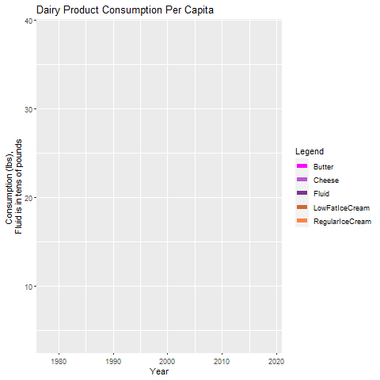

```{r setup, include=FALSE}
knitr::opts_chunk$set(echo = TRUE)
library("pagedown")
# install.packages("pagedown")
# remotes::install_github("hrbrmstr/markdowntemplates")
#uncomment to get packages for pretty document
```

## Setting the stage

Our consulting team has been approached by a wealthy business person. Our client, who just happens to love dairy products, has had the life-long dream of opening their own creamery. They are unsure of where to start, so we have been hired to aide in decision making throughout the process. Our major points of concern are where to locate the creamery, what products to make, and what difficulties could arise or things should we be aware of in terms of food safety. 

We have combed the USDA and FDA data to make recommendations to ensure their dreams become a reality.

## Location, location, location

When deciding on a location for a creamery, several factors need to be taken into consideration. This includes land costs, government regulations (such as environmental and food safety laws), tax rates, and consumer demand. However, above all these factors, milk acquisition is the most important aspect of location decision making. Without milk to process, a creamery is essentially useless. It is true that there is milk produced in 49 states - it used to be 50 until the sole dairy on the island of Hawaii was shutdown because of its environmental impact...and smell. However, it is costly to haul milk, so you would want to place a creamery in a location that is not only in close proximity to dairies but also close to a large supply of milk.  

#### Introducing the data

```{r, include = FALSE}
# silent
urlfile <- "https://raw.githubusercontent.com/rfordatascience/tidytuesday/master/data/2019/2019-01-29/state_milk_production.csv"
dairycsv <- read.csv(urlfile)
dairybystate <- as.data.frame(dairycsv)
```

```{r, echo = FALSE}
head(dairybystate)
```

This data set includes the milk produced, annually, for each of the 50 states from 1970 to 2017. It consists of 2400 rows with 4 variables. As you can see, there is a column depicting the region in which each state lies. While this isn't necessarily important to our location analysis, it does become important in the "real world" as each region has it's own dairy association that operates within it. These associations allocate check-off dollars, a set dollar amount that is taken out of each milk check based on the amount of milk produced, to help with the promotion of dairy product consumption. The national check-off dollar amount is held at a constant value, but each region can set its own check-off price. 

#### Historical milk production

To best get an idea of where to build the creamery, we can't just look at where the most milk is being produced now. While the milk produced per cow is fairly consistent across the United States, the number of cows in each state changes fairly frequently. These changes reflect differences in milk prices and feed costs as well as the expansion and construction of processing plants. Thus, we need to focus more on historical trends instead of current values. 

##### Channel your inner Indiana Jones

Before we can start an analysis, we need to explore the data

```{r}
range(dairybystate$milk_produced)
```

This shows us that within the entire data set, we have a minimum milk produced of 3,000,000 lbs and a maximum of 42,339,000,000 lbs. Yikes, that's a large range. Just out of curiousity, let's find out who they are.

```{r}
which.min(dairybystate$milk_produced)
which.max(dairybystate$milk_produced)
```

Wonder who the minimum is (let's be honest...the low is either Alaska or Hawaii)

```{r}
dairybystate[2199,]
```

Like I said, Alaska or Hawaii. 
I'm betting the high is California (because happy cows are in CA...or just very hot ones).

```{r}
dairybystate[2248,]
```

Of course, it was California. On top of that, 2014 was a great year for dairy in California with high milk prices and government incentives for agricultural expansion, so that isn't surprising at all.

#### Questionable cartography

To best get a visualization on the changes in production across the US, a map that clearly shows all 50 states trumps a line plot with 50 lines to try and differentiate from each other. But with a map, you don't want to generate one for each of the 48 years this data spans. That's just overwhelming. It is also obviously not ideal to plot the full range of milk production, because with a range this large, the continuous fill scale would be so broad that it wouldn't accurately depict the data. So, we have to break this down. 

##### Making milestones 

To keep things concise, we are going to focus on milestone years: 1970, 1980, 1990, 2000, 2010, and 2017. 

```{r, message=FALSE, warning=FALSE}
library(tidyverse)
dairymile <- dairybystate %>% filter(year %in% c("1970", "1980", "1990", "2000", "2010", "2017"))
```

##### Setting scale

To help with determining the range of the scale, we are now going to find the ranges of these years. 

```{r}
range(dairymile$milk_produced)
```

So it looks like our minimum value is 3,000,000 and our maximum value is 40,385,000,000. 

Well, that didn't help much, but logically, we can eliminate the lower bounds because we aren't interested in these small states with limited supply; we want the milk. 

#### Welcome to Miss America 2020

```{r, include = FALSE}
library(usmap)
library(ggplot2)

usa <- plot_usmap(regions = "states", data = dairymile, values = "milk_produced", color = "black") + 
  scale_fill_continuous(low = "purple", high = "orange", name = "Production, lb", label = scales::comma, breaks = c(10000000000, 20000000000, 30000000000, 40000000000), limits = c(2500000000, 45000000000)) +
  labs(title = "Dairy Production in the United States") + 
  theme(panel.background = element_rect(color = "black", fill = "white"), legend.position = "right")

usadairy = usa + facet_wrap(~ year, ncol = 3) +
    theme(legend.position = "right",
          strip.background = element_blank()) +
    labs(fill = "Milk Produced, lb",
         title = "Milk produced by state from 1970 to 2017")
```

```{r}
usadairy
```

As you can see, the clear finalists in our pagent are Wisconsin and California. Number 3 is up for debate. It seems that our contenders are Texas, Minnesota, Iowa, Michigan, Ohio, Pennsylvania, and New York. This is a bit easier to work with.

#### Winners and losers

Since we have whittled our 50 contestants down to just these 7 candidates, it is now easier to differentiate between them in a line graph. So, that is exactly what we are going to do. 

```{r, echo=FALSE, fig.align='center', message=FALSE, warning=FALSE, out.width='80%'}
library(ggplot2)

dairy7 <- dairybystate %>% 
  filter(state %in% c("Texas", "Minnesota", "Iowa", "Michigan", "Ohio", "Pennsylvania", "New York"))

dairycontest = dairy7 %>% 
  ggplot(aes(x = year, y = milk_produced, group = state, color = state)) +
  geom_line() +
  geom_point() +
  scale_color_manual(values = c("purple", "magenta", "orange", "purple4", "orchid2", "orangered", "maroon3"))
```
```{r}
dairycontest
```

We can see here that even though Texas made an *epic* comback, New York is our best bet. As a proud Cyclone alum though, it's a little sad to see Iowa at the bottom. Thank goodness we still have corn... 

#### The finalists are...

Let's take a look at California, Wisconsin, and New York in a similar fashion as above.

```{r, echo=FALSE, fig.align='center', message=FALSE, warning=FALSE, out.width='80%'}
library(ggplot2)

dairytop <- dairybystate %>% 
  filter(state %in% c("California", "Wisconsin", "New York"))

dairytop3 = dairytop %>% 
  ggplot(aes(x = year, y = milk_produced, group = state, color = state)) +
  geom_line() +
  geom_point() +
  scale_color_manual(values = c("purple", "magenta", "orange"))
```

```{r}
dairytop3
```

Even though California clearly has the most milk, you can tell it has been on a downward trend at the tail end while Wisconsin has continued to steadily grow. New York doesn't even stand a chance in this race. 

### The judges are deliberating

As I mentioned above, there are other factors to consider when deciding on a location. Below are some key characteristics to note of our top 3 locations:

##### California

The Golden State has strict environmental laws that need to be considered not only with construction but also operation of the facility. However, California is also known for their wine country. Everyone likes to pair cheese with wine, and the culinary culture of the area is prime for artisan cheeses.

##### New York

The cost of land in New York is outrageously expensive. They have a huge population that covers a small spanse, so their is competition for land and its resources. But that large population is also a positive. With large, urban cities like Albany, Buffalo, and New York City, their is demand for artisan products, similar to California. 

##### Wisconsin

It's America's Dairyland. It's on every sign and license plate in the state. There is nothing more iconic than a dairy-based company in the Dairy State. But yet, that is its downfall. The dairy market is pretty saturated in Wisconsin with numerous processing plants and creameries. Competition would be high. 

#### And the winner is....

Taking all these factors into consideration, **Wisconsin** would be the best choice. The hurdles of land cost and environmental regulations in New York and California are too much for a fledgling business. On top of that, the competition in Wisconsin is *possible* to overcome. First off, people flock to Wisconsin for mostly one reason. No, it is not Wisconsin Dells, but in fact, cheese. Between local and tourist/visiting customers, there will still be demand for good, high-quality cheese. Second, we are now in an era that is ruled by online shopping. By also running an online store-front, we can earn revenue through web-based purchases. Lastly, it is much easier to ship cold and refrigerated products than in past years. It would be easy to contract with local and national food chains, gas stations, and grocery stores to distribute our product. For both of these last reasons, the more central (albeit northern) location of Wisconsin gives it an advantage over its coastal competitors. 


=======

## Profitable Products 

Now with the location decided, it is time to look into the various dairy products and explore how to maximize profitability. There are several avenues to take when selling milk including contracts, spot price, and self-processing. Contracts can be made with local cooperatives who then provide products for larger businesses. Spot prices are the current market prices and are the easiest way to sell, but also have a lot of risk through volatile markets. The final method is to open your own processing plant, or collaborate to open one. This has a high start-up cost with the equipment for pasteurization and processing as well as passing inspections. To figure out the best route to take, let's take a closer look at the retail prices, farm value, and consumer demand for different dairy products. 

### Introducing the Data

The data used in this preliminary analysis is provided by the USDA ERS:
https://www.ers.usda.gov/data-products/dairy-data/
Variables in these datasets are mainly numeric, pertaining to production and sales of dairy products. The first exploration looks at the prices. Between the four products examined, there are 72 rows and 4 columns (Year, Retail Price, Farm Value, Farm Share) of data.

The second dataset contains the consumption per capita in the U.S. for dairy products. This is summarized by year for 42 years and contains several products. 

### Data Manipulation

The first step was to read the csv files in with matching headers using the readr package (Hadley Wickham, Jim Hester and Romain Francois, 2018) and join the tables together. A column was added to differentiate the products when the tables were combined. Adding columns and filtering was done through tidyverse (Wickham et al., 2019) and then displayed through the DT package (Xie, Cheng, and Tan, 2020).
```{r read_data, include=FALSE, message=FALSE, warning=FALSE}
library(readr)
library(tidyverse)
library(DT)

ice_cream_header<-c("Year","RetailPrice_Dollars","FarmValue_Dollars","FarmShare_Percent","","")
ice_cream <- read_csv("ice_cream.csv", 
                       col_names = ice_cream_header, 
                       col_types = "dddd_", skip = 3) %>%
  filter(Year <= 2018) %>%
  select(-5)

whole_milk_header<-c("Year","RetailPrice_Dollars","FarmValue_Dollars","FarmShare_Percent","","")
whole_milk <- read_csv("whole_milk.csv", 
                       col_names = whole_milk_header, 
                       col_types = "dddd_", skip = 3) %>%
  filter(Year <= 2018) %>%
  select(-5)

butter_header<-c("Year","RetailPrice_Dollars","FarmValue_Dollars","FarmShare_Percent")
butter <- read_csv("butter.csv", 
                       col_names = butter_header, 
                       col_types = "dddd_", skip = 3) %>%
  filter(Year <= 2018) %>%
  select(-4)

cheese_header<-c("Year","RetailPrice_Dollars","FarmValue_Dollars","FarmShare_Percent")
cheese <- read_csv("cheese.csv", 
                       col_names = cheese_header, 
                       col_types = "dddd_", skip = 3) %>%
  filter(Year <= 2018) %>%
  select(-4)

consupt_header<-c("Year","Fluid","Cheese","Butter","RegularIceCream","LowFatIceCream")
pcconsp <- read_csv("pcconsp.csv", 
                       col_names = consupt_header, 
                       col_types = "dddddd", skip = 6) %>%
  filter(Year <= 2019)

head(whole_milk)
NROW(whole_milk)

butter<-butter%>%
  mutate(FarmShare_Percent=FarmValue_Dollars/RetailPrice_Dollars*100)

cheese<-cheese%>%
  mutate(FarmShare_Percent=FarmValue_Dollars/RetailPrice_Dollars*100)

cheese<-cheese%>%
  mutate(Product="Cheese")
butter<-butter%>%
  mutate(Product="Butter")
ice_cream<-ice_cream%>%
  mutate(Product="Ice_Cream")
whole_milk<-whole_milk%>%
  mutate(Product="Whole_Milk")

AllProducts<-rbind(butter,cheese,ice_cream,whole_milk)
```

```{r displaydata, echo=FALSE}
DT::datatable(AllProducts)
DT::datatable(pcconsp)
```

### Data Exploration
#### Retail Prices

First, let's look at the retail prices over time between whole milk, ice cream, butter, and cheese. Per pound, cheese and ice cream have a much higher retail price than whole milk and butter. What is also note-worth is the increase of these retail prices over time. Cheese and ice cream also have the greatest increase in retail price over the last 18 years, especially compared to whole milk which has remained relatively the same and actually decreased in 2015 to 2018. This line graph was produced using the ggplot2 package (H. Wickham, 2016) and the colors are from ColorBrewer (Erich Neuwirth, 2014). 
```{r prices, include=FALSE}
retail<- ggplot(data=AllProducts, aes(x=Year, y=RetailPrice_Dollars, group=Product,color=Product)) +
  geom_line(aes(color=Product))+
  geom_point()+
  geom_smooth(method=lm,formula='y~x', se= FALSE)+
  scale_color_brewer(type='seq',palette='PuOr')
```
```{r retailplot, echo=FALSE}
retail
```

#### Farm Value

The next thing to look at is the actual price the farmer receives for each of these products. As this graph shows, the price to the farmer is much more volatile than the retail price, even between year to year averages. There are many factors than influence the farmer's payment price, so the retail price does not often reflect the farm value. The farmer receives more from a pound of milk or butter than from a pound of ice cream. This makes sense based upon the number other ingredients in ice cream that also contribute to its overall retail price. The producer makes about the same amount for cheese as whole milk and butter, but recall that the retail price of cheese is much higher. So the next step is to compare these values. 
```{r farmvaluesilent, include=FALSE}
library(ggplot2)
library(reshape)
library(gganimate)

farmvalue<-ggplot(data=AllProducts, aes(x=Year, y=FarmValue_Dollars, group=Product,color=Product)) +
  geom_line(aes(color=Product))+
  geom_point()+
  geom_smooth(method=lm,formula='y~x', se= FALSE)+
  scale_color_brewer(type='div',palette='PuOr')
```
```{r farmvalue, echo=FALSE}
farmvalue
```

#### Farm Share

Below is a visual representation using a bar graph of the dairy's fraction of the retail price. This is averaged across all of the years in the dataset and displayed by product. Cheese has the greatest retail price, but also one of the largest gaps between the farm share and the total price. Whole milk and butter are very similar where it appears a little more than 50% of the total retail price goes to the dairy. Now let's actually calculate this difference. The difference between the farm value and the retail price are from the expense of transporting, processing, and marketing these products. Especially in a market with very perishable items, these expenses are high and can only be minimized by taking on the processing and marketing yourself with a [store-front creamery](https://www.lancasterfarming.com/farming/dairy/direct-sales-offer-alternative-to-commodity-milk/article_4131e179-7233-58ea-987d-cbef8db77742.html). 
```{r farmsilent, include=FALSE}
to_plot <- data.frame(x=AllProducts$Product,RetailPriceDollars=AllProducts$RetailPrice_Dollars,FarmValueDollars=AllProducts$FarmValue_Dollars)
melted<-melt(to_plot, id="x")
share<-ggplot(melted,aes(x=x,y=value,group=x,fill=variable)) + 
  geom_bar(stat="identity",position = "identity")+
  scale_fill_brewer(type='seq',palette='PuOr')+
  labs(title="Farm Share of Retail Price by Product",x="Product",y="Value ($)")
```
```{r shareplot,echo=FALSE}
share
```
To graph two different attributes in the same bar graph, the package Reshape was used (H. Wickham, 2007).

#### Farm Share Percentage by Product

The box plot below shows the actual values of this farm share by product. Ice cream has approximately 17% farm share while butter has approximately 53% farm share. Whole milk is not far behind with 48% farm share. It should also be noted that there is variability in the return between years based upon the products. Whole milk and butter have a wider range of farm share values between years. This is likely because the retail price follows the farm price more closely in these products than it does in ice cream or cheese, so there is more volatility and at a slight lag to the farm price. 

```{r productsilent, include=FALSE}
productcomp<- AllProducts %>%
  mutate(Product = fct_reorder(Product, FarmShare_Percent, .fun='median')) %>%
  ggplot( aes(x=reorder(Product, FarmShare_Percent), y=FarmShare_Percent, fill=Product)) + 
    geom_boxplot() +
    xlab("Product") +
    theme(legend.position="none") +
    xlab("")+
  scale_fill_brewer(type='seq',palette='PuOr')
```
```{r productplot, echo=FALSE}
productcomp
```

#### Dairy Consumption Per Capita

Finally, as we think about products that would be worthwhile to process in our creamery, it is important to look at consumer demand for these products and not just price. This line graph was produced using the consumer data in ggplot2 (H. Wickham, 2016). It shows how the demand for each product has changed over the past 40 years. The animation was made using the gganimate package (Thomas Lin Pedersen and David Robinson, 2020). 

```{r consumptionsilent,include=FALSE}

colors <- c("Fluid" = "mediumorchid4", "Cheese" = "mediumorchid", "Butter" = "magenta","RegularIceCream"="sienna1","LowFatIceCream"="sienna3")
ggplot(data=pcconsp, aes(x=Year))+
  geom_line(aes(y=Fluid/10,color="Fluid"), size = 2)+
  geom_line(aes(y=Cheese,color="Cheese"), size =2)+
  geom_line(aes(y=Butter,color="Butter"), size = 2)+
  geom_line(aes(y=RegularIceCream,color="RegularIceCream"), size = 2)+
  geom_line(aes(y=LowFatIceCream, color="LowFatIceCream"), size =2)+
  labs(title="Dairy Product Consumption Per Capita", x = "Year",
      y = "Consumption (lbs), 
      Fluid is in tens of pounds",
      color = "Legend")  +
  scale_color_manual(values = colors)
# + transition_reveal(Year)
# 
# consumption<-anim_save("DairyConsumption")

# To shorten the length of time to compile the document, this animation was saved as a gif and then added below instead of generated each time. The code used to create the animation is commented out above. 
```


Per person in the United States, butter and low fat ice cream consumption has remained fairly constant. Fluid milk and regular ice cream has decreased over time. The most surprising conclusion from this graph is cheese consumption has nearly doubled over this time from 17 lbs/person to nearly 40 lbs/person.

## Product Recommendations

Based upon the preliminary price analysis and consumer demand, it is recommended to produce your own specialty cheese and ice cream to sell online or store front in a direct farm to consumer business model. This would help put more of the retail price in your pocket. In this business, you should also [hire Becca](https://furbeck.github.io/cv.pdf) to pair your cheeses with meat in charcuterie board packages.   

The milk that is not used in your own production should be sold through a contract with [Kwik Trip Dairy](https://www.kwiktrip.com/our-story). They sell milk and butter to their customers and you will still receive a large portion of these sales.

```{r cheesepic, echo=FALSE,out.width = '25%'}
knitr::include_graphics("cheesepic.jpg")
```


=======

## Building a Brand, and Reducing Recalls 

When establishing a brand, food safety and consumer trust are **paramount**. One must produce quality products, but beyond that, food that has been contaminated with allergens or pathogens can greatly harm the consumer, and business as witnessed by the [Blue Bell Recalls](https://www.foodsafetynews.com/2019/08/the-blue-bell-ice-cream-listeria-outbreak-and-its-fallout/). In order for the client to be aware of the current hazards of the dairy industry, food recall data is presented with analysis in the recommendations below.

### Data Acquisition and Filtering
In order to determine possible issues during the processes of products, we utilized the FDA food recall database listings from 2016-2020. These were procured as a .csv for 2018-2020, and scraped from archived FDA websites.

#### Scraping from XML Tables
I wanted to have a dataset of U.S. food recalls over the past 5 years to have a more comprehensive view of concerns, however this meant I had to use archived webpages from 2016-2017. The FDA websites provided XML data in HTML tables on multiple webpages (14 for 2016, 18 for 2017), rather than the .csv or excel output that was available for 2018-2020. To do this, I utilized the XML package (Lang, 2020) to scrape and purrr (Henry and Wickham, 2020) to list the data from the pages. 

```{r silentFDA, include=FALSE, warning=FALSE, message=FALSE}
# Load in 2018-2020 data
FDA1<-read.csv("FDA.csv", skip = 1)

#Load relevant packages
library(XML)
library(dplyr)
library(purrr)
#These break the table scraper somehow so detach them 
unloadNamespace("maps")
unloadNamespace("usmap")

#Scrape 2016 tables
tbls16<-capture.output(for (i in 1:14){
  print(paste0('http://wayback.archive-it.org/7993/20180125100707/https://www.fda.gov/Safety/Recalls/ArchiveRecalls/2017/default.htm?Page=',i,''))
})

#Scrape 2017 tables
tbls17<-capture.output(for (i in 1:18){
  (print(paste0('http://wayback.archive-it.org/7993/20180125100804/https://www.fda.gov/Safety/Recalls/ArchiveRecalls/2016/default.htm?Page=',i,'')))
})

#Merge tables
FDAoldtbl<-c(tbls16,tbls17)
FDAoldtabl<-as.data.frame(FDAoldtbl)
front<-gsub("^.....","",FDAoldtabl$FDAoldtbl)
back<-gsub('.{1}$','', front)
OldJoin<-back %>% map(readHTMLTable)
```

These tables were then cleaned (photo column removed from 2016-2017, and Product Type column removed as it contained many nonsensical assignments).

```{r cleanandmerge, message=FALSE, warning=FALSE, include=FALSE}
#Okay, I know this is bad. I just got tired and brute forced everything together. The nesting structures were not playing nice with my late night brain so here we are. 
Old<-rbind(OldJoin[[1]][["NULL"]],OldJoin[[2]][["NULL"]],OldJoin[[3]][["NULL"]],OldJoin[[4]][["NULL"]],OldJoin[[5]][["NULL"]],OldJoin[[6]][["NULL"]],OldJoin[[7]][["NULL"]],OldJoin[[8]][["NULL"]],OldJoin[[9]][["NULL"]],OldJoin[[10]][["NULL"]],OldJoin[[11]][["NULL"]],OldJoin[[12]][["NULL"]],OldJoin[[13]][["NULL"]],OldJoin[[14]][["NULL"]],OldJoin[[15]][["NULL"]],OldJoin[[16]][["NULL"]],OldJoin[[17]][["NULL"]],OldJoin[[18]][["NULL"]],OldJoin[[19]][["NULL"]],OldJoin[[20]][["NULL"]],OldJoin[[21]][["NULL"]],OldJoin[[22]][["NULL"]],OldJoin[[23]][["NULL"]],OldJoin[[24]][["NULL"]],OldJoin[[25]][["NULL"]],OldJoin[[26]][["NULL"]],OldJoin[[27]][["NULL"]],OldJoin[[28]][["NULL"]],OldJoin[[29]][["NULL"]],OldJoin[[30]][["NULL"]],OldJoin[[31]][["NULL"]],OldJoin[[32]][["NULL"]])
Old<-as.data.frame(Old)

#Remove null photo column and not helpful Product Type Column
Old<-Old %>% select(-" Details/Photo ") 
FDA1<-FDA1 %>% select(-"Product.Type")

#Merge 2016-2017 with 2018-2020 Tables
matchnames<-c("Date","Brand.Name.s.","Product.Description","Recall.Reason.Description","Company.Name")
colnames(Old)<-matchnames
Old<-as.data.frame(Old)
FDA1<-as.data.frame(FDA1)
FDA<-rbind(Old,FDA1)
```

This gives us the following dataset:
```{r FDAstr, echo=FALSE}
str(FDA)
```

The variables are:
*Date - Date of recall, character later split into numeric dates and abbreviations
*Brand Name - Character
*Recall Reason - Character
*Company Name - Character

#### Interesting Entries
Sometimes this data set had ambiguous entries. One of the items they recalled was Whole Foods 8-20-20. What does that mean? An entire store? Also, sometimes items are put into weird categories in product.type, so this variable was removed to avoid confusion or excessive filtering. Instead, I decided to search the dairy items by the Production Description. 
```{r wholefoods, echo=FALSE}
library(dplyr)
FDA %>% filter(Product.Description=="8-20-2020, Whole Foods Market")
```
We had to find a good list of dairy products that would be current and appropriate. The federal register has a list for U.S. specific items, but a broader worldview is preferred. Wikipedia has lists of dairy products and cheeses, and strings containing the product names could be scrapped to have a comprehensive list to filter the FDA data with. 

#### Wikipedia to the rescue!
The htmltab package (Rubba, 2020) can be used to scrape tables off Wikipedia. The first column includes the name of the dairy product or cheese, so these could be pulled from all tables with purrr's map as shown in code chunk below. The names were combined into the dairy object, preview below:
```{r wikipedia, echo=TRUE, results='hide', warning=FALSE, message=FALSE}
library(purrr)
library(htmltab)
library(tidyr)
url = 'https://en.wikipedia.org/wiki/List_of_dairy_products'
url2 = "https://en.wikipedia.org/wiki/List_of_cheeses"

tbls <- map2(url, 1:23, htmltab, rm_nodata_cols =F)
tblname<-map(tbls, 1)
dairy1<-unlist(tblname)

tbls2 <- map2(url2, 1:23, htmltab, rm_nodata_cols =F)
tblname2<-map(tbls2, 1)
dairy2<-unlist(tblname2)

dairy<-c(dairy1,dairy2)
```

```{r dairylist, echo=FALSE}
head(dairy)
```

#### Filter Non-Dairy Imitations and Nut-Butters
Then further filtering was performed as some of the strings had interesting consequences. A type of product called "So" pulled soybean so I had to pull that out, and "butter" gave an inevitable "Nut butter" problem that had to be negated. The "getout" object was created and partnered with dpylr (Wickham, 2020) to remove these non-dairy products from the desired dairy output. 
```{r FDA filter, echo=TRUE, results='hide', warning=FALSE, message=FALSE}
library(stringr)
library(dplyr)

dairy
dairy2<-print(dairy[dairy!="So"])     

matchesdairy <- grepl(paste(dairy2, collapse = "|"), FDA$Product.Description)
matchesdairy2<-print(FDA$Product.Description[matchesdairy])

getout<-c("Butter nut","Butternut", "Peanut", "Non-Dairy","Butterfly", "Beanit","Panque","Sunflower","Nut", "Cashew", "Imitation")

filtereditems <- grepl(paste(getout, collapse = "|"), matchesdairy2)
filtereditems2<-print(matchesdairy2[filtereditems==F])

DairySet<-FDA %>% filter(Product.Description %in% filtereditems2)

```

```{r dairyset, echo=FALSE, warning=FALSE, message=FALSE}
library(DT)
DT::datatable(DairySet)
```

###  What are the frequently recall reasons?

Now that we have filtered the relevant items, it is time to investigate what are the common reasons for recall. In order to make a visualization for this, I made a wordcloud. Words were separated and put into dataframes using stringr (Wickham, 2019) and tm (Feinherer and Hornik, 2019). A dataframe containing words and their frequency was then passed to the wordcloud (Fellows, 2018) function to generate the following plot:
```{r, echo=FALSE, warning=FALSE, message=FALSE}
library(stringr)
library(tm)
library(RColorBrewer)
library(wordcloud)

#Get rid of punctuation and get individiual words
nopunct<-gsub('[[:punct:] ]+',' ',DairySet$Recall.Reason.Description)
nopunct<-trimws(nopunct)
wordsextract<-str_split(nopunct, " ")
wordsextract<-unlist(wordsextract)

#Determine frequency of words and make dataframe for wordcloud
docs <- Corpus(VectorSource(wordsextract))
dtm <- TermDocumentMatrix(docs) 
matrix <- as.matrix(dtm) 
words <- sort(rowSums(matrix),decreasing=TRUE) 
wordclouddf <- data.frame(word = names(words),freq=words)

#Wordcloud plot
set.seed(5658) # for reproducibility 
wordcloud(words = wordclouddf$word, freq = wordclouddf$freq, min.freq = 1, max.words=200, random.order=FALSE, rot.per=0.20,colors=brewer.pal(8, "PuOr"))
#purple and orange to be color friendly

```

From the wordcloud we can see that "undeclared" and "*Listeria*" are of high occurrence. Undeclared is a term associated with the inclusion of unlabeled allergens. Production must be sure to label allergens if they are in product, and shifts must occur with allergen containing products at the end to avoid contamination of products that to not contain them. *Listeria* is of high concern, as this pathogen is potentially fatal. It can produce biofilms, sticky polysaccharides that allow it to adhere to processing surfaces if sanitation is not adequate.  

I was curious if there were particular times of year to worry about *Listeria*; *E.coli* is a mesophile, meaning it likes body temperature for growth, so we generally see its recalls peak during the summer. *Listeria*, on the other hand, is a psychrophile, or a "cold-lover". Because it grows at refrigeration temperatures, and cheese is generally kept in a cold chain, I was not expecting to see peak months.

### Are there seasonal patterns in recalls?
To plot recall frequency over month, the Date column was separated into month, day and year columns with lubridate (Gerolemund and Wickham, 2011) and given to ggplot2 (Wickham, 2016) for histogram generation. 
```{r, include=FALSE, warning=FALSE, message=FALSE}
library(lubridate)
#Make month, day, and year variables to investigate seasonal trends
DairySet<-DairySet %>% mutate(Date = mdy(Date))%>%mutate(year = lubridate::year(Date),
                    month = lubridate::month(Date),
                    day = lubridate::day(Date))
#Use month abbreviations for visualization purposes
DairySet$month<-month.abb[DairySet$month]
```

```{r, echo=FALSE, warning=FALSE, message=FALSE}
library(ggplot2)
recallplot<-ggplot(DairySet, aes(month))+geom_histogram(aes(fill=..count..),stat = "count")+ scale_x_discrete(limits = month.abb)+        scale_fill_gradient("Count", low = "purple", high = "orange")+ylab("Number of Recalls")+xlab("Month")+ggtitle("Recalls of U.S. Dairy Products during 2016-2020")
recallplot
```

Despite the hypothesis that recalls would not have seasonal abnormalities, February jumped out.

I decided to investigate further as to what went wrong this month, and saw multiple retailers (Meijer, Sargento) associated with *Listeria* in cheese from the 10th through the 28th of February, 2017. I thought this could be an outbreak related to a copacking distributor. Often, commercial retailers or large brands will have separate facilities assist in manufacturing product for their brand to broaden the supply chain. 
Data that led to these observations is shown below, as formatted by the DT package (Xie, Cheng, and Tan, 2020).
```{r, echo=FALSE, warning=FALSE, message=FALSE}
febtable<-DairySet %>% filter(month == "Feb") %>% select("Date","Product.Description","Recall.Reason.Description","Company.Name")
DT::datatable(febtable)
```

A quick web search [confirmed](https://www.statnews.com/2017/03/09/cheese-recall-sargento-indiana/) this suspicion. Luckily, no one became sick from this outbreak, because such an efficient recall system was in place, however Sargento dropped this facility as a supplier. If our business person was looking to co-pack, they should be sure to implement safety and recall protocols. Even if they do not wish to copack, and remain a smaller producer, *Listeria* still remains a hazard to look out for, and they should be sure to understand how to mitigate its presence in product, otherwise there could be [large consequences](https://www.foodsafetynews.com/2018/04/vulto-creamery-shut-down-because-owner-did-not-understand/).

### Recommendations
The producer will need to ensure proper practices in their plant, and audit potential copackers to control *L.monocytogenes*. If purchasing used equipment, microbial testing should be performed to ensure units are not contaminated with *Listeria* biofilms. Product-label matching should be performed as a critical control point for allergen labelling. 

## Conclusions

In conclusion, it is recommended to start the creamery in Wisconsin where resources are available and regulations are relatively low. To overcome the competition in America's Dairyland, a direct-to-consumer business should be developed to sell ice cream and specialty cheese, carefully paired with flavorful meats. Remaining milk can be sold through contracts. The final recommendation is to employ preventative measures against *Listeria* and be proactive about product labeling to prevent expensive recalls and keep loyal customers. 


### Citations
Christian Rubba (2020). htmltab: Assemble Data Frames from HTML Tables. R package version
  0.7.1.1. https://CRAN.R-project.org/package=htmltab

Duncan Temple Lang (2020). XML: Tools for Parsing and Generating XML Within R and S-Plus. R
  package version 3.99-0.5. https://CRAN.R-project.org/package=XML
  
Erich Neuwirth (2014). RColorBrewer: ColorBrewer Palettes. R package version 1.1-2.
  https://CRAN.R-project.org/package=RColorBrewer
  
Garrett Grolemund, Hadley Wickham (2011). Dates and Times Made Easy with lubridate. Journal of
  Statistical Software, 40(3), 1-25. URL http://www.jstatsoft.org/v40/i03/.
  
H. Wickham. ggplot2: Elegant Graphics for Data Analysis. Springer-Verlag New York, 2016.

H. Wickham. Reshaping data with the reshape package. Journal of Statistical
Software, 21(12), 2007.

Hadley Wickham (2019). stringr: Simple, Consistent Wrappers for Common String Operations. R package version 1.4.0. https://CRAN.R-project.org/package=stringr
  
Hadley Wickham, Jim Hester and Romain Francois (2018). readr: Read Rectangular
  Text Data. R package version 1.3.1.  https://CRAN.R-project.org/package=readr
  
Wickham et al., (2019). Welcome to the  tidyverse. Journal of Open Source
  Software, 4(43), 1686,  https://doi.org/10.21105/joss.01686

Hadley Wickham, Romain François, Lionel Henry and Kirill Müller (2020). dplyr: A Grammar of Data Manipulation. R package version 1.0.2. https://CRAN.R-project.org/package=dplyr
  
Hadley Wickham (2020). tidyr: Tidy Messy Data. R package version 1.1.2.
  https://CRAN.R-project.org/package=tidyr

Ian Fellows (2018). wordcloud: Word Clouds. R package version 2.6.
  https://CRAN.R-project.org/package=wordcloud
  
Ingo Feinerer and Kurt Hornik (2019). tm: Text Mining Package. R package version 0.7-7.  https://CRAN.R-project.org/package=tm
  
Lionel Henry and Hadley Wickham (2020). purrr: Functional Programming Tools. R package version  0.3.4. https://CRAN.R-project.org/package=purrr


Lionel Henry and Hadley Wickham (2020). purrr: Functional Programming Tools. R package version
  0.3.4. https://CRAN.R-project.org/package=purrr
  
Paolo Di Lorenzo (2020). usmap: US Maps Including Alaska and Hawaii. R package version 0.5.1.
  https://CRAN.R-project.org/package=usmap

Thomas Lin Pedersen and David Robinson  (2020). gganimate: A Grammar of Animated
  Graphics. R package version 1.0.7.  https://CRAN.R-project.org/package=gganimate
  
Yihui Xie (2017). printr: Automatically Print R Objects to Appropriate Formats According to  the 'knitr' Output Format. R package version 0.1. https://CRAN.R-project.org/package=printr

Yihui Xie, Joe Cheng and Xianying Tan (2020). DT: A Wrapper of the JavaScript Library  'DataTables'. R package version 0.16. https://CRAN.R-project.org/package=DT

Yihui Xie (2020). knitr: A General-Purpose Package for Dynamic Report Generation in R. R  package version 1.30.

Yihui Xie, Romain Lesur, Brent Thorne and Xianying Tan (2020). pagedown: Paginate the HTML
  Output of R Markdown with CSS for Print. R package version 0.12.
  https://CRAN.R-project.org/package=pagedown

